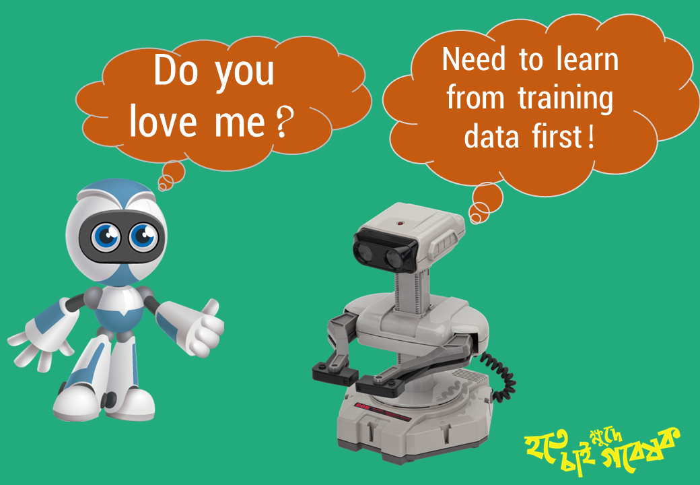

# ৩.১ঃ আর্টিফিশিয়াল ইন্টেলিজেন্স

### - কি এবং কেন

আর্টিফিশিয়াল ইন্টেলিজেন্স বা "কৃত্রিম বুদ্ধিমত্তা" মনেহয় বর্তমান সময়ে কম্পিউটার সায়েন্সের সবচেয়ে বড় গবেষনার ফিল্ড এবং এখন পর্যন্ত এই ফিল্ডের সফলতাও সবচেয়ে বেশি। 

এটি আসলে অনেক বিস্তর একটা ফিল্ড। মানুষ যেভাবে তার ব্রেইন এবং ইন্দ্রীয় দিয়ে কাজ করে, ঠিক অনুরূপ কাজই যন্ত্র নিয়ে করানোর প্রয়াসেই এই আর্টিফিশিয়াল ইন্টেলিজেন্স বা "কৃত্রিম বুদ্ধিমত্তা" তৈরির চিন্তা বিজ্ঞানিদের গবেষক করে তুললো। 

সচরাচর কাজ যখন এলগোরিদমিক প্রক্রিয়ায় কম্পিউটার মেশিনের সাহায্যে সলভ করা হয় সেটিকে সহজ ভাষায় বলা হয়ে থাকে আর্টিফিশিয়াল ইন্টেলিজেন্স বা "কৃত্রিম বুদ্ধিমত্তা"।

যেমন- রোবট, সেলফ ড্রিভেন কার, চ্যাটবট এবং এরকম আরও অসংখ্য।

আর্টিফিশিয়াল ইন্টেলিজেন্সের সাব-ফিল্ডগুলোর মধ্যে কিছু বেসিক পার্থক্য থাকলেও বিগিনার হিসেবে সেগুলোকে খুব বেশি আলাদা হিসেবে বুঝতে পারবোনা। চলুন সংক্ষেপে দেখে নেই আর্টিফিশিয়াল ইন্টেলিজেন্সের সাব-ফিল্ডগুলোর পরিচয়-

### - সচরাচর সাব-ফিল্ডসমূহ









`বিঃ দ্রঃ বর্তমানে আর্টিফিশিয়াল ইন্টেলিজেন্স যে মানুষের মাথা খেয়েছে সেটা বলতে দিধা নাই। শুধু মাথা খেয়েছে বলতে গেলে ভুল হবে, বিকল্প মাথা তৈরিও করেছে বটে। বিশাল বড় এই ফিল্ডের মূল চালিকাশক্তি হল ম্যাথমেটিকস বা গণিত। প্রোবাবিলিটি থিওরি এবং লিনিয়ার অ্যালজেবরা দিয়ে মানুষের নিউরোনের লজিক কৃত্রিমভাবে বিল্ট করাই হল আর্টিফিশিয়াল ইন্টেলিজেন্স।`

`কিন্তু আমাদের কাজ করতে গেলে গণিতের সেইসকল টার্ম ম্যানুয়ালি খুব একটা ব্যবহার করতে হয়না। সেজন্য তৈরি হয়েছে প্রোগ্রামিং ল্যাংগুয়েজগুলোর উন্নত সব লাইব্রেরী। এই কাজের জন্য পাইথন একটা বিকল্পহীন টুলস বলা চলে। কারন নিউমেরিক কম্পিউটেসন এবং মেশিন লার্নিং, ডিপ লার্নিং এর কাজের জন্য পাইথনের বিশেষ কিছু লাইব্রেরী রয়েছে, যার বিকল্প নাই।  আমি পরবর্তীতে প্রতিটি সেকশনে সম্ভাব্য প্রয়োজনীয় টুলস সম্পর্কে লেখার চেষ্টা করবো।`

