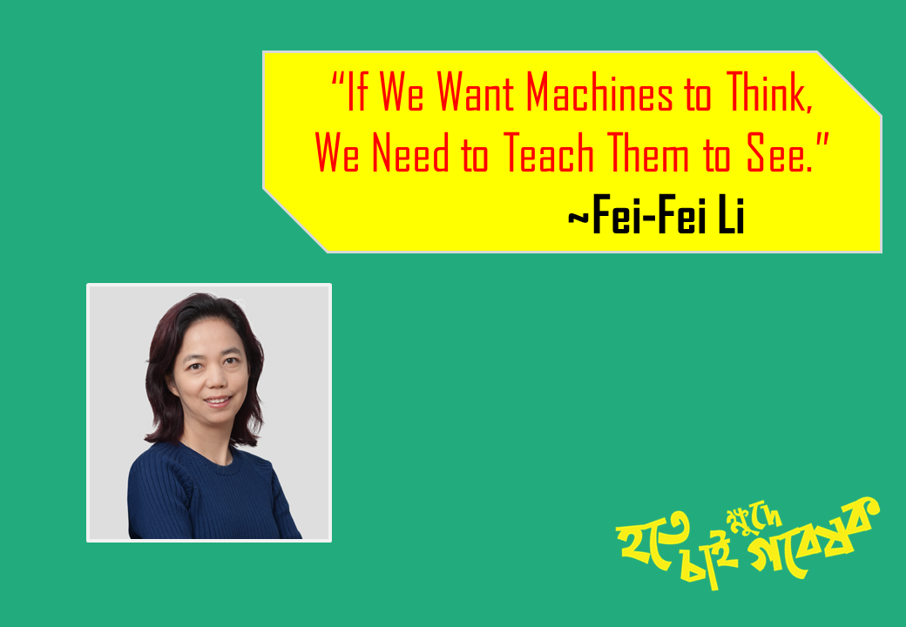

# - কম্পিউটার ভিশন

### - কি এবং কেন

চিন্তা করুন সেলফ ড্রিভেন কারের কথা। আমরা নাহয় আমাদের চোখের মাধ্যমে দেখতে পারি, তাহলে কম্পিউটার কিভাবে রোডের অবস্থা সম্পর্কে অবগত হয়?

হ্যা, ঠিক এই ধারনাটিকেই বাস্তবে প্রয়োগ নিয়ে যেখানে কাজ হয়, সেটিকেই বলে কম্পিউটার ভিশন। কম্পিউটার যন্ত্র "কম্পিউটার ভিশনের" মাধ্যমে কিছু দেখে এবং সে অনুযায়ী মানুষের মত ডিসিশন নেয়। আমরা সাধারণত ছবি, ভিডিও, আ্যানিমেশন নিয়ে যত কাজ করে থাকি তা সবই কম্পিউটার ভিশনের অন্তর্ভুক্ত।

কিন্তু প্রশ্ন আসতে পারে, কেন আমি এটাকে এ-আই এর সাব-ফিল্ড লিখলাম।  এটা বলার যথেষ্ট কারন রয়েছে। আমরা জেনেছি মেশিন লার্নিং, ডিপ লার্নিং বা আর্টিফিশিয়াল ইন্টেলিজেন্স যাই বলি না কেন, সবকিছুতেই কম্পিউটার ডেটা থেকে শিখে এবং সে অনুযায়ী ডিসিশন প্রদান করে। আর সেই ডেটা যদি হয় ভিজুয়াল ডেটা বা কম্পিউটার ভিশনের ডেটা তাহলে?

তখন আসলে কম্পিউটার ভিশন আর আর্টিফিশিয়াল ইন্টেলিজেন্স একসাথে মিলেমিশে প্রবলেম সলভ করবে। আর সেজন্যই দুটি ফিল্ড একে অন্যের সাথে সম্পর্কিত। 

বর্তমান সময়ে যেসকল টাইপের কাজ কম্পিউটার ভিসন দিয়ে হচ্ছে-

### - বাস্তব প্রয়োগ 

* হাতের লেখা অক্ষর চিহ্নিতকরন
* সেলফ ড্রিভেন কার রাস্তায় চলাচল
* ফেস রিকগনিশন
* ইশারা ভাষা সাধারণ মানুষের বোধগম্য করা
* বিভিন্ন ডকুমেন্ট ক্লাসিফিকেশন
* অবজেক্ট ডিটেকশন
* স্তন ক্যান্সার প্রেডিকশন
* লিখিত ডকুমেন্টকে রিড করা
* শরীরের ভেতরের ছবি বা এক্স-রে ডেটা দিয়ে রোগ সম্পর্কে জানা
* অগমেন্টেড রিয়্যালিটি
* ভার্চুয়াল রিয়্যালিটি

